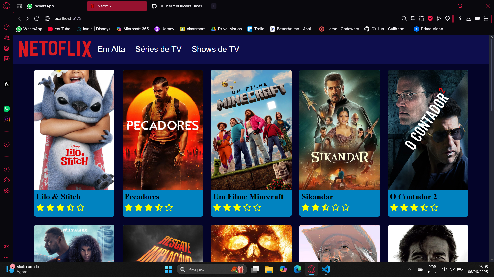
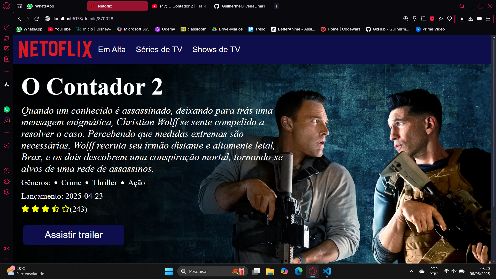

# Projeto Netoflix

O projeto consiste em um catálogo de filmes fornecido através de uma API pública: https://www.themoviedb.org/.
Suas funcionalides são:
- Listar o catálogo  de filmes
- Mostrar uma avaliação de 0 a 5 estrelas
- Mostrar os detalhes dos filmes:
  - Título
  - Resumo
  - Gênero
  - Data de lançamento
  - Avaliação de 0 a 5 estrelas junto com o número de avaliações
  - Botão "assistir trailer" que direciona ao trailer do filme no YouTube

## Design do Projeto

## Página principal


## Página de detalhes 


## Como executar o projeto

1. Clonar o projeto ou baixar os arquivo para a sua máquina.
2. Instalar as dependências executando o comando abaixo dentro da pasta raiz do projeto:

```
npm i
```
3. Executar a aplicação com o comando: 

```
npm run dev
```
4. Abrir o endereço fornecido em algum navegador:
   
```
http://localhost:5173/ 
```